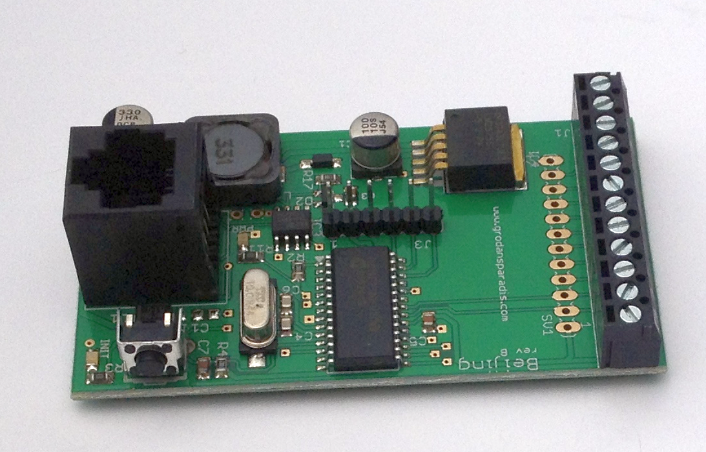

# Beijing - General I/O module

**Document reversion**: 1.0.0 2015-07-07

Copyright © 2000-2025 Åke Hedman, [Grodans Paradis
AB](http://www.grodansparadis.com),
<[akhe@grodansparadis.com](akhe@grodansparadis.com)\>

This documentation is for the [Beijing
module](http://www.grodansparadis.com/beijing/beijing.html). 

  - [Introduction](Introduction)
  - [Getting Started](Getting%20Started)
  - [Hardware](Hardware)
  - [CAN4VSCP cabling](CAN4VSCP%20cabling)
  - [Updating the firmware](Replacing%20the%20firmware)
  - [Registers](registers)
  - [Abstractions](Abstractions)
  - [Alarms](Alarms)
  - [Decision Matrix](decisionmatrix)
  - [Events](Events)
  - [Recipes](Recipes)
  - [faq](faq)

[filename](./bottom-copyright.md ':include')
